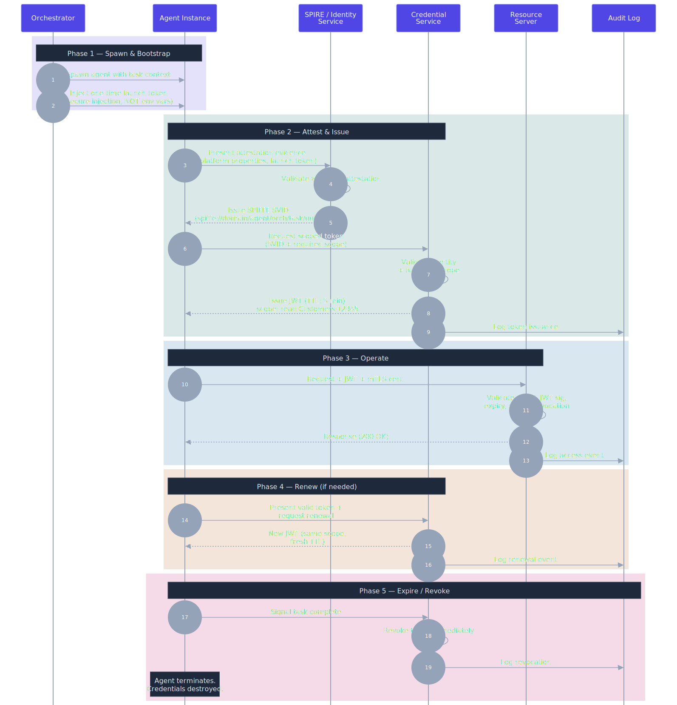

# Credential Lifecycle

**Pattern:** Ephemeral Agent Credentialing v1.3
**Back to:** [Pattern Document](../versions/v1.3.md#component-1-ephemeral-identity-issuance)

---

End-to-end lifecycle of an agent's credentials, from spawn to termination. Each phase is color-coded:

1. **Spawn & Bootstrap** — Orchestrator injects a one-time launch token via secure injection (never env vars)
2. **Attest & Issue** — Agent presents attestation evidence, receives SPIFFE SVID and scoped JWT
3. **Operate** — Agent makes authenticated requests with mTLS + JWT validation
4. **Renew** — For long-running tasks, token is renewed with same or narrower scope
5. **Expire / Revoke** — Agent signals task completion, credentials are destroyed

