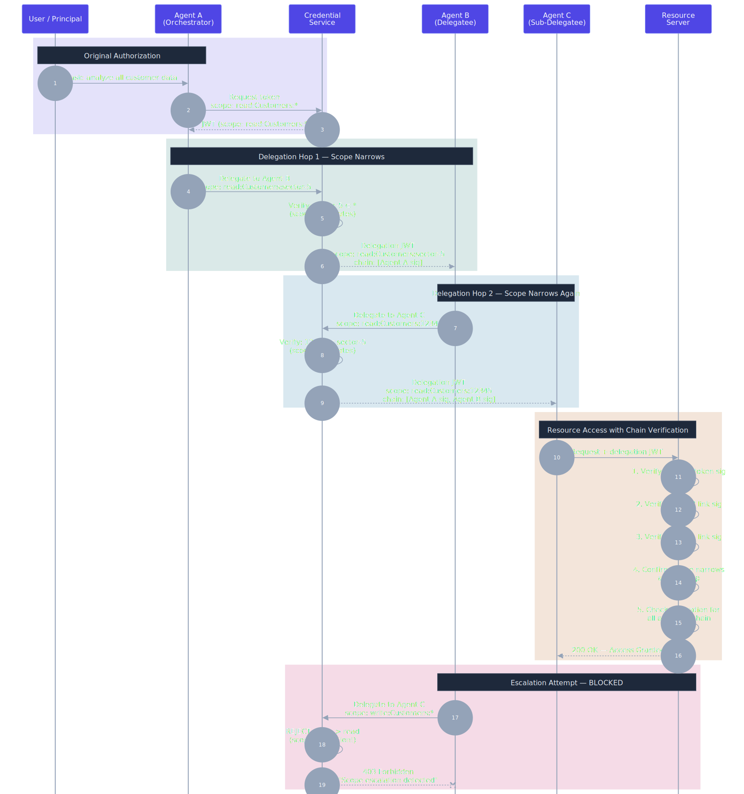

# Delegation Chain Verification

**Pattern:** Ephemeral Agent Credentialing v1.3
**Back to:** [Pattern Document](../versions/v1.3.md#component-7-delegation-chain-verification)

---

Demonstrates how scope attenuation works across a multi-agent delegation chain, and how escalation attempts are blocked.

**Flow:**
1. User authorizes Agent A with `read:Customers:*`
2. Agent A delegates to Agent B with narrowed scope `read:Customers:sector-5`
3. Agent B delegates to Agent C with further narrowed scope `read:Customers:12345`
4. Resource server verifies the entire chain cryptographically before granting access
5. An escalation attempt (`write` > `read`) is rejected with 403

**Key principle:** Permissions can only narrow at each hop, never expand.

