# Adoption Roadmap

**Pattern:** Ephemeral Agent Credentialing v1.3
**Back to:** [Pattern Document](../versions/v1.3.md#adoption-path)

---

A 6-phase incremental adoption path. Each phase builds on the previous one, delivering security value at every stage.

| Phase | Focus | Timeline |
|-------|-------|----------|
| 1 | Visibility & Assessment | 2-4 weeks |
| 2 | Reduce Credential Exposure | 4-8 weeks |
| 3 | Task Scoping | 8-16 weeks |
| 4 | Full Zero-Trust | 8-12 weeks |
| 5 | Delegation Chain Verification | 4-8 weeks |
| 6 | Optimize & Extend | Ongoing |

